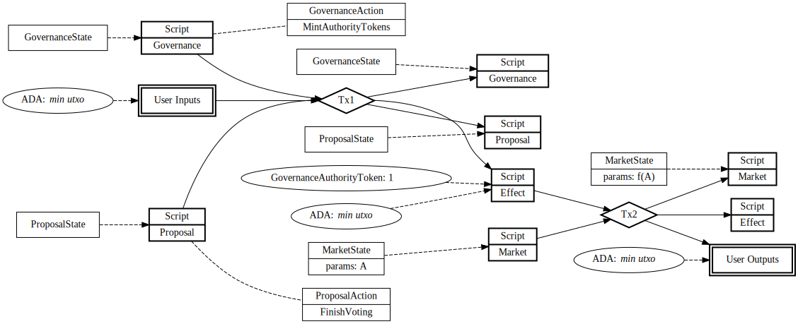

# Authority token technical design

| Spec Status | Impl Status | Last Revision |
|-------------|-------------|---------------|
| WIP         |  WIP        | 2022-01-18    |

--------------------

**Spec Ownership:** [@Emily Martins]

**Authors**: [@Emily Martins]

**Impl Owner:** [@Emily Martins]

[@Emily Martins]: https://github.com/emiflake

--------------------

## Authority Tokens

In order to allow proposals to have a large number of potential effects, and to be extensible for different applications of governance, it is useful to have the effects be decided at a later time. In Ethereum systems, often times this is done by encoding some untyped data and calls to specific contract hashes. Compound encodes it with `address[] Proposal.targets` (the contracts to be called) and `bytes[] Proposal.calldatas` (the data to be passed). Of course, this doesn't quite translate to Cardano's EUTXO model, so we need to achieve this some different way.

In order to allow this flexibility, there are two facts that we rely on:
- We trust the community to validate the proposal entirely, including whether or not the effects encoded in it are written correctly. (This may mean we have a set of known and trusted effects we agree are correct and safe, collectively)
- The effects are given authority only after the proposal that promises them succeeds.

To achieve the former is rather simple, the effect validator's source code is available for anyone to look at, and it hashes correctly to the hash stored in the proposal itself. So, the LQ holders can decide on whether it is a positive for the system.

In order to achieve the latter, we must introduce some way to give effects authority to perform their actions.

We do this by handing out "Governance Authority Tokens" (GATs) to each of the the effects belonging to a proposal after the proposal passes. When these authority tokens are *burned*, they act as a way of saying "the DAO validated this, so trust that I will ensure this transaction is correct".

The components that need to be adjustable at a later point, will need to allow this as means for proving authority and validation of a transaction. So, for example, a Liqwid Market might need to have its parameters updated, the following diagram shows how this would happen after a proposal has successfully been voted on and passed:

As a result of this approach, there's a number of benefits, but also details we need to watch out for.

#### Handling multiple effects in a single Proposal

Handling multile effects this way is very doable. For one, a single effect can do multiple things at once, if the script sizes allow it. But another point is that a proposal can have a *list* of hashes that it distributes GATs to. And this is all without growing size almost at all, because the actual effects are encoded in their scripts.

There is the concern of expiration date of effects and incomplete execution now, however. But the customizability allows for failsafes (like retrying) and encoding expiration correctly. Due to the nature of these effects being handled by the DAO, it's assumed no conflicting effects will be executed in short succession. This is essentially impossible to encode in the system itself, so this tradeoff must be taken.

#### Writing effect code needs a *lot* of care

Having delegated the authority of *the entire system* in a single token is a lot of power for one tiny script. And with great power comes great responsibility. It is important that this token doesn't fall into the wrong hands or is executed in a way that was unexpected (by the community). There's a few things we can do to help mitigate this:

- We write the validator with the transaction in mind specified out in fullest. No extra inputs, no extra outputs, no extra mints, etc. Essentially this is the opposite of what we do in other places, where we try to be only as specific as we need.
- We have the transaction be executed by one of a number of community trusted members. This of course is something that is encoded in the effect, rather than anywhere else.

Hopefully, this is sufficient to ensure the transactions are created correctly, and nothing unexpected slips in. This problem is no more complicated or dangerous than elsewhere where we delegate certain trust or authority to just the validation or movement of a token.
