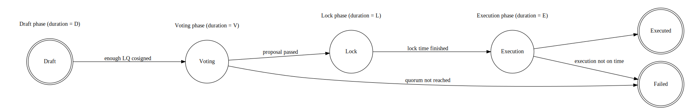

# Proposals technical design

This document gives an overview of the technical design of the proposals system for introducing, voting on and executing governance proposals.

| Specification | Implementation | Last revision |
|:-----------:|:-----------:|:-------------:|
| WIP         |  WIP        | v0.1 2022-04-27    |

---

**Specification ownership:** [Emily Martins]

**Authors**:

-   [Emily Martins]
-   [Jack Hodgkinson]

**Implementation ownership:** [Emily Martins]

[Emily Martins]: https://github.com/emiflake

[Jack Hodgkinson]: https://github.com/jhodgdev

**Current status**:

Imported from Liqwid by [Emily Martins]. Underwent rewrite by [Jack Hodgkinson].Further amendments to the 'period table' should be considered.

---

## Proposals

Initiating a proposal requires the proposer to have more than a certain amount of GT staked in the system e.g. 5GT. This is checked by consuming the UTXO representing the user's stake. Initiating a proposal creates a script, which will handle all voting interactions.

## Voting

### Voting stages

The life-cycle of a proposal is neatly represented by a state machine, with the 'draft' phase being the initial state, and 'executed' and 'failed' being the terminating states.

**Please note that this state-machine representation is purely conceptual and should not be expected to reflect technical implementation.** This is because some state transitions in the state machine representation don't need to happen in the actual implementation as a transaction. A key example is going from the "lock" phase to the "execution" phase. The only thing that needs to happen is that time goes by. So under the hood, they are represented the same in the Proposal's datum.

> Emily 2022-04-27: This is quite confusing still, I feel. @Jack, could you try to reword this and make it more clear?




#### When may interactions occur?

Consider the following 'stages' of a proposal:

-   `S`: when the proposal was created.
-   `D`: the length of the draft period.
-   `V`: the length of the voting period.
-   `L`: the length of the locking period.
-   `E`: the length of the execution period.

| Action                              | Valid POSIXTimeRange                | Valid _stored_ state(s) |
|-------------------------------------|-------------------------------------|-------------------------|
| Witness                             | \[S, ∞)                             | \*                      |
| Cosign                              | \[S, S + D)                         | Draft                   |
| AdvanceProposal                     | \[S, S + D)                         | Draft                   |
| Vote                                | \[S + D, S + D + V)                 | Voting                  |
| Unlock                              | \[S + D, ∞)                         | \*                      |
| CountVotes                          | \[S + D + V, S + D + V + L)         | Voting                  |
| ExecuteProposal (if quorum reached) | \[S + D + V + L, S + D + V + L + E) | Voting                  |

> Jack 2022-02-02: I will consider revising this table further at a later time.

#### Draft phase

During the draft phase, a new UTXO at the proposal script  has been created. At this stage, only votes in favor of co-signing the draft are counted. For the proposal to transition to the voting phase, a threshold of GT will have to be staked backing the proposal. This threshold will be determined on a per-system basis and could itself be a 'governable' parameter. It's important to note that cosignatures are not locking votes. Cosignatures are more like a delegated approval to a proposal. The sum of all cosignatures must tally to the threshold, and all cosigner stake datums must fit into a single transaction to witness their size.

#### Voting phase

In the voting phase, users may utilise their stakes to vote in-favour or in-opposition to a proposal. This will add their vote to the relevant count. There is potential for contention within the system and therefore voting on proposals may have to be rate-limited. The method by which a user's stakes are weighted and the thresholds required for proposals to pass are determined on a per-protocol basis.

#### Lock phase

Upon completion of the voting phase, a proposal will either have been passed or failed. A delay between the passing of a proposal and execution of its effects will be enforced, to allow users to prepare for incoming changes to the system. It'll further give the system maintainers opportunity to intervene, in the case of a hostile action.

#### Execution phase

Failed proposals will not be interacted with further. The only value they will contain is their state thread tokens and the minimum ADA requirement, so little of worth is lost.

Successful proposals will be verified by the governor component, which will issue ['governance authority tokens'](/docs/tech-design/authority-tokens.md) (GATs) to a proposal's separate 'effects'. The burning of these tokens will be a pre-requisite for system changes to be made, therefore the possession of one will serve as a form of 'licence' for making the changes.

There will be a deadline before which a proposal's effects will have to be executed. As any passed proposal's effects will necessarily have been supported by the community, it can be presumed that community members will have be incentivised to ensure the effects are enacted soon after the proposal has been passed.

#### Encoding of results

Most proposals are simply looking for approval for a particular transaction to take place. We encode the potential outcomes of the proposal in the following way (calling them "effects"):

```haskell
type Effect =
  -- Effect validator hash
  ( ValidatorHash
  -- Hash of datum sent to effect validator with GAT
  , DatumHash
  )

-- We need to tag the various possible outcomes with some sort of tag.
data ResultTag = ResultTag Integer

-- Finally, we can encode all possible outcomes, each having zero or more effects.
data ProposalDatum = ProposalDatum
  { ... -- omitted
  , effects :: Map ResultTag [Effect]
  }
```

In order to now encode a simple approval vote as described above, we just need to encode both the approval and disapproval outcomes:

```haskell
yesNo :: [Effect] -> Map ResultTag [Effect]
yesNo positiveEffects =
  Map.fromList
    [ -- Proposal didn't gain approval, nothing happens.
      (ResultTag 0, [])
      -- Proposal gained approval, the effects promised are executed.
    , (ResultTag 1, yes)
    ]
```

Encoding multiple different outcomes is possible by adding more pairs to the map. As part of validation of creation of a proposal, it's important to ensure that there is always a "negative" outcome. Otherwise an attacker could create a proposal that encodes two different outcomes, yet with both a net-negative towards the system.

#### Proposal metadata

Proposals carry very little metadata in their datums. They carry only their id -- which identifies them in a convenient incremental number -- and their original cosigners. The rest is data required for their functioning. It may however be useful to carry some extra metadata on-chain in order for the front-end to be able to identify and display relevant information to the users.

In order to achieve this, we can, upon the creation of a proposal, pass along the relevant information in the metadata field. Establishing a standard for how this should be laid out is yet to be done, but it could look as simple as a number of fields indicating the title, description, tags, etc. Since this metadata is only present in the creation of the proposal, it won't add to the transaction size for future transactions belonging to the proposal. The information can still be looked up by looking at the mint transaction of that particular proposal state thread.
